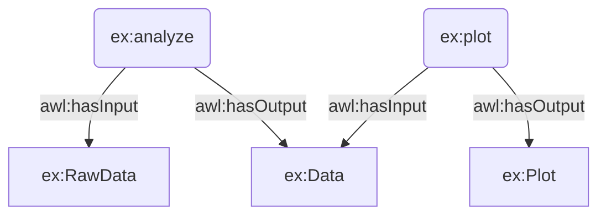

[](https://doi.org/10.5281/zenodo.14771726 )

## Background
Workflows play an essential part in structuring the processing of both physical objects and data. 
Despite the relevance of detailed information about the processing history of a resulting asset for provenance, compareability and reproduceability 
a detailed and machine readable description of the workflow is usually not part of our scientific work and publication.
AWL and AWL-LD address this issue by creating tools and definitions to document both experimental and computational workflows. 
The aim is to provide common notations for workflows in order to generate a semantic description that allows further analytics and transformations based on OO-LD.

# Abstract Workflow Language Schema

Application of [OO-LD](https://github.com/OO-LD/schema) on [Abstract Syntax Trees](https://en.wikipedia.org/wiki/Abstract_syntax_tree) in order share workflow descriptions and map them to RDF.

For illustration we use the AST generated by the python std-lib [ast module](https://docs.python.org/3/library/ast.html). However, the concept should work with any AST (examples see https://astexplorer.net/) although it is recommeded to stick to core language patterns with broad language support.

## Objectives
- Language-agnostic JSON serialization
- Support for any pattern that is supported by programming languages (Conditions, Loops, Function calls)
- Option to restrict supported features via JSON-SCHEMA (e.g. don't allow class declarations, allow only a whitelist of function calls, restrict function call parameters)
- Option to map to RDF via JSON-LD context in order to allow complex analytics and queries via SPARQL or SHACL (e.g. find all workflows that make use of certain functions in a specific order)

## Use Cases

### Conceptual Assessment
* What is the input and output of a node? 
* Validate a planned workflow => Is it executeable, Is it scientifically sound? [see example](#Validation_of_Workflows)
* Validate executed workflow => Did a state / constellation / path occur that is not valid (probably due to knowledge that was not present while planning)?
* Path finding: How can nodes be connected to get from input type A to output of type B? [see example](#Planning_of_Workflows)

### Code Execution Provenance through code / system inspection
* What were the parameters that the workflow my_workflow was ever executed with?
* What was y in function_two when my_workflow was executed with parameters (1,2)
* How long did the execution of the workflow my_workflow (1,2) took, what were the most expensive execution steps?
* What was the architecture of the node this most expensive computation step was execute on (e.g. number of cores, memory)
* Which package versions were loaded? Was scipy scipy version \< 1.15 used?

### Execution Environment Provenance (out of scope for AWL, needs workflow environment / versionized file store)
* Which workflows used in their execution a docker container "xyz" for a specific node?
* What was the version number/conda enviroment/git_commit for the node function_two in the workflow execution of my_workflow that resulted in output=1?
* what was the content of that file when my_workflow was executed with parameters (1,2)

## Playground
A playground to work with AWL can be found here: [AWL Playground](https://oo-ld.github.io/playground-awl/?data=N4Ig9gDgLglmB2BnEAuUMDGCA2MBGqIAZglAIYDuApomALZUCsIANOHgFZUZQD62ZAJ5gArlELwwAJzplsrEIgwALKrNSgAAlnhQqAD3EoA2qEryUIZVCgREKAPQOwYALTYAJgDoA5jCjKInhecA7mrkqqsg4KBoTWtvZOBmR0ENhUXtI%2BMWyaeGSIVPE2do7Obp6%2B%2FoHBoeGRamS5ILxQghDFlprtnQowHoSaAwp4YB6ChOYoABKFAApkUuJsAHKpXVojltMAakswZHgZCtqkBkZaBUUlieUpaRlZUjkgAL5vbOQvVFDIOxRsLNCgAVJY%2BX4KABuchEmxAw0GAKBc0Q%2B2wcNOOj0hg0IBhGK6CIJmI%2BbAAkkQ8YipoCUJSsedcWgQGMJrSgZSQVJSZ9wFIqNgbsj6UQAGJyG5fGhGEDTVEAYQQHn8cHgCiwaSWZCg0n%2BcrpqIASjAfNY5vAPEqtVIddIFJB9fLCgB5Tq23VSBQZIiy52IAAyVF9Fqt9Ag2s9CiIIngGGp2wNKMKYtjPDVCrk8jy2Iu1OuRISZWS%2BlS6Uy2Ra6wYHJQqbjsAQ7z54KdhsKAEEXiIGLoFLwANZUQQUaQeNvJxAAaWHo6kHi7Ph7VD7bHBtdRM8mbwAul9%2FCdLB2AOoBhS9IlgTjccR8xDKMAUXhUKRSPWEGC6F9kdNNr5RIkxjAP4oFtCAABYFDIDgyH0VBQLhNghyoCBeAQKgwCIXgSRoVAiElKg%2BQ4Wh1RZNoOiJABZcYRBONg2UmExQHIvpLAZejxkY0xWgvQgO0QRBTXVL5wV%2Bf5uJYolq2KNhEwIXc2BwvFJMIJUkHIVd8VhLoAEYPj3flBWFCTeKPAShPPUS%2FlQEyKMIaT%2BiRVl3gMpSyNMkA1MQDSVi0wlUAAZn06VvOUjzrQjAUNXDSN3yYni7MsLyfOhbTUD0gyfUuBLWJABzZKcsh3jYR0bOYjyAFEAEcXOCkAL14ITpFwkwdw%2BIA%3D%3D) (Work in progress)

## Schema

### Python-AST
Note: The context makes use of type-scoped contexts, see https://www.w3.org/TR/json-ld11/#scoped-contexts

Note: The schema section is empty allowing any AST. However, workflow domains should define a restricted set of e.g. function calls that represent available and safe options.

```yaml
'@context':
  - awl: https://oo-ld.github.io/awl-schema/
    ex: https://example.org/
    '@base': https://oo-ld.github.io/awl-schema/
    _type: '@type'
    id: '@id'
    body: awl:HasPart
    Name:
      '@id': awl:Variable
      '@context':
        '@base': https://example.org/
    targets: awl:HasTarget
    value:
      '@id': awl:HasValue
      '@context':
        value: '@value'
    If:
      '@id': awl:If
      '@context':
        body: awl:IfTrue
    orelse: awl:IfFalse
    test: awl:HasCondition
    comparators: awl:HasRightHandComparator
    ops: awl:HasOperator
    left: awl:HasLeftHandComparator
    func:
      '@id': awl:HasFunctionCall
      '@context':
        '@base': https://example.org/
        Name: awl:Function
        value: awl:HasValue
    args: awl:HasArgument
    keywords:
      '@id': awl:HasKeywordArgument
      '@context':
        value: awl:HasValue
    arg: awl:HasKey
title: AWL
type: object
```

### Blocks

#### If-Else-Block

```python
if a == 1:
    b = 1
else:
    b = 'test'
```
> Python Code


```yaml
_type: Module
body:
  - _type: If
    body:
      - _type: Assign
        targets:
          - _type: Name
            id: b
        value:
          _type: Constant
          value: 1
    orelse:
      - _type: Assign
        targets:
          - _type: Name
            id: b
        value:
          _type: Constant
          value: test
    test:
      _type: Compare
      comparators:
        - _type: Constant
          value: 1
      left:
        _type: Name
        id: a
      ops:
        - _type: Eq
type_ignores: []
```
> AST


```turtle
<https://example.org/run> <http://www.w3.org/1999/02/22-rdf-syntax-ns#type> <https://oo-ld.github.io/awl-schema/Function> .
<https://example.org/x> <http://www.w3.org/1999/02/22-rdf-syntax-ns#type> <https://oo-ld.github.io/awl-schema/Variable> .
_:b0 <http://www.w3.org/1999/02/22-rdf-syntax-ns#type> <https://oo-ld.github.io/awl-schema/Module> .
_:b0 <https://oo-ld.github.io/awl-schema/HasPart> _:b1 .
_:b0 <https://oo-ld.github.io/awl-schema/HasPart> _:b3 .
_:b1 <http://www.w3.org/1999/02/22-rdf-syntax-ns#type> <https://oo-ld.github.io/awl-schema/Assign> .
_:b1 <https://oo-ld.github.io/awl-schema/HasTarget> <https://example.org/x> .
_:b1 <https://oo-ld.github.io/awl-schema/HasValue> _:b2 .
_:b2 <http://www.w3.org/1999/02/22-rdf-syntax-ns#type> <https://oo-ld.github.io/awl-schema/Call> .
_:b2 <https://oo-ld.github.io/awl-schema/HasFunctionCall> <https://example.org/run> .
_:b3 <http://www.w3.org/1999/02/22-rdf-syntax-ns#type> <https://oo-ld.github.io/awl-schema/Expr> .
_:b3 <https://oo-ld.github.io/awl-schema/HasValue> _:b4 .
_:b4 <http://www.w3.org/1999/02/22-rdf-syntax-ns#type> <https://oo-ld.github.io/awl-schema/Call> .
_:b4 <https://oo-ld.github.io/awl-schema/HasArgument> <https://example.org/x> .
_:b4 <https://oo-ld.github.io/awl-schema/HasFunctionCall> <https://example.org/run> .
```
> RDF


#### Funtion call

```python
x = run(a=1))
run(x)
```
> Python Code


```yaml
_type: Module
body:
  - _type: Assign
    body: []
    value:
      _type: Call
      args: []
      func:
        _type: Name
        id: run
      keywords:
        - _type: keyword
          arg: a
          value:
            _type: Constant
            value: 1
    targets:
      - _type: Name
        id: x
  - _type: Expr
    body: []
    value:
      _type: Call
      args:
        - _type: Name
          id: x
      func:
        _type: Name
        id: run
      keywords: []
type_ignores: []
```
> AST


```turtle
<https://example.org/run> <http://www.w3.org/1999/02/22-rdf-syntax-ns#type> <https://oo-ld.github.io/awl-schema/Function> .
<https://example.org/x> <http://www.w3.org/1999/02/22-rdf-syntax-ns#type> <https://oo-ld.github.io/awl-schema/Variable> .
_:b0 <http://www.w3.org/1999/02/22-rdf-syntax-ns#type> <https://oo-ld.github.io/awl-schema/Module> .
_:b0 <https://oo-ld.github.io/awl-schema/HasPart> _:b1 .
_:b0 <https://oo-ld.github.io/awl-schema/HasPart> _:b3 .
_:b1 <http://www.w3.org/1999/02/22-rdf-syntax-ns#type> <https://oo-ld.github.io/awl-schema/Assign> .
_:b1 <https://oo-ld.github.io/awl-schema/HasTarget> <https://example.org/x> .
_:b1 <https://oo-ld.github.io/awl-schema/HasValue> _:b2 .
_:b2 <http://www.w3.org/1999/02/22-rdf-syntax-ns#type> <https://oo-ld.github.io/awl-schema/Call> .
_:b2 <https://oo-ld.github.io/awl-schema/HasFunctionCall> <https://example.org/run> .
_:b3 <http://www.w3.org/1999/02/22-rdf-syntax-ns#type> <https://oo-ld.github.io/awl-schema/Expr> .
_:b3 <https://oo-ld.github.io/awl-schema/HasValue> _:b4 .
_:b4 <http://www.w3.org/1999/02/22-rdf-syntax-ns#type> <https://oo-ld.github.io/awl-schema/Call> .
_:b4 <https://oo-ld.github.io/awl-schema/HasArgument> <https://example.org/x> .
_:b4 <https://oo-ld.github.io/awl-schema/HasFunctionCall> <https://example.org/run> .
```
> RDF

## Code Execution

Beside the static code analysis with AST we can also trace the actual code execution e.g. with the [python tracing module](https://docs.python.org/3/library/trace.html).
This provides us with a detailed log about the called functions, taken paths in control structures (If-Else, While), state of internal variables and timing information.

Example (see also [playground](https://oo-ld.github.io/playground-awl?data=N4Ig9gDgLglmB2BnEAuUMDGCA2MBGqIAZglAIYDuApomALZUCsIANOHgFZUZQD62ZAJ5gArlELwwAJzplsrEIgwALKrNSgAAlnhQqAD3EoA2qEryUIZVCgREKAPQOwYALTYAJgDoA5jCjKInhecA7mrkqqsg4KBoTWtvZOBmR0ENhUXtI%2BMWyaeGSIVPE2do7Obp6%2B%2FoHBoeGRamS5ILxQghDFlprtnQowHoSaAwp4YB6ChOYoABKFAApkUuJsAHKpXVojltMAakswZHgZCtqkBkZaBUUlieUpaRlZUjkgAL5vbOQvVFDIOxRsLNCgAVJY%2BX4KABuchEmxAw0GAKBc0Q%2B2wcNOOj0hg0IBhGK6CIJmI%2BbAAkkQ8YipoCUJSsedcWgQGMJrSgZSQVJSZ9wFIqNgbsj6UQAGJyG5fGhGEDTVEAYQQHn8cHgCiwaSWZCg0n%2BcrpqIASjAfNY5vAPEqtVIddIFJB9fLCgB5Tq23VSBQZIiy52IAAyVF9Fqt9Ag2s9CiIIngGGp2wNKMKYtjPDVCrk8jy2Iu1OuRISZWS%2BlS6Uy2Ra6wYHJQqbjsAQ7z54KdhsKAEEXiIGLoFLwANZUQQUaQeNvJxAAaWHo6kHi7Ph7VD7bHBtdRM8mbwAul9%2FCdLB2AOoBhS9IlgTjccR8xDKMAUXhUKRSPWEGC6F9kdNNr5RIkxjAP4oFtCAABYFDIDgyH0VBQLhNghyoCBeAQKgwCIXgSRoVAiElKg%2BQ4Wh1RZNoOiJABZcYRBONg2UmExQHIvpLHrX94AAEWDKCXn%2BZiLymbtez%2BXifH%2BUxWkEnYXig%2BBJHIRtSPgWjsDXWTLDgthcHgFcwFQABGXc2A8YMyFo0STD3EAByfUz8IsiTrNs9cUBU7A1Js0d4GwQRW1QYxrIgMASN8%2FyrLYGFbQ09zsD5BiAoEijCA7RBEFNdVtM%2FPTUAAJki2F4RYoklSQchVxAHScpQfL8UK25iwcdIhC8OhPxCMAHDwEQMCHKAHAecsvAwRAoQAfihF90rAT9yQ8ABeIgqHAxgPAATgADjId4vnBX4JKS1iQGrYo2ETERvWyyQ8t3T5DqJI1fhEKRMsqq79JQABmArCTxYrCBO%2FokRALS3t066vo%2BazTKwD1pH4GBECMQKsvBj6DLYeANkIGMGzVNDdIUAUoGepBUFiu6pOSti0yU7iqXU8S%2FukuVhJXUTGYOqmjvXNd5OAnU1XJ1TGcISZUeqxhjJAezzOwSyUa83hZccgLnIoVzYqQ7ywr4tW2GC0K%2FL1iK6uinxhY8%2BLxkYyT%2FssR6SZey60dQAA2H7MTIlnAbO4HxbB6q3ahkzuGkO0pARpH9cDiHGEx7HLFxji2lHImnpe%2F4KZYe7CHYumeM55nqdZpcROQIumO5oleblfnFKFtyRdLwh4wliGNsp%2B2W75hTBabJuPNFyxBnbj7O%2BhszVdN2zlan%2BWnO1zXm9snBjaZ03DbX8LFai5erfom3EurwhHdJl3qrWz2ipZgAhT83W9YNLhPyxfZARM29jj61r5KqIavuACAxcjodg8IMPkUhTTWBAUSd%2BiZR7f1QL%2FEOMsw5w0jrgaOpt%2F7jwTjWJOtN8YBAFKdEAxNSZZ1Ul3Fm%2Bc1T0zEvxV%2Bpdly6ArqXLm3da5kHrv3ZSzdXJygvhDAyRkc7MO4bwpSltPKCIIGPQyYjc4yQtr3AW0jB6yI0jLYR6MjKTwcgvY%2B3dSpIx4SsJBKBRHX1QAABmlrPFWRiZ4axiivHW69F4gC3j5TxMc95uIPqyI%2BVdu4MkPuyUJLNUrpR8K9XBhlvogG%2BBCBWyjjrYz9q3XRiTpY4VgYQTMHlGHGJ9pkj%2BwNtoKKsZ9aWycClv3KYmZOSkCZkISTUvkQ4Rxji8R0gytTpb9NqtIQUwo7bRLShlHJVj47JL2mk5h8DgZf36VLay%2BTvYlyKdmDhpSS7LMIPIyxBl1lsHqVso6hzCF4wQKnfS1TTldNnL0mOazUF6Gwek60EYBQanDJGd8UTtkIDMRVYZNiUD2Osj6F%2B3drlCMeblP%2B71DIjLsPso6ABxW8O4yTpOPMoGAdFgmRImSXGJ0zHkAHZdo%2FEWfCppwNEH9OpXk%2BqlySpZhKcCq5TLsk0poQc%2FlI8ZkGTZdZC56SEUtOIcoUhYq2VIRefOPpqKrFsqGeqgyHt%2BRjK6IrT5cKWY%2FKWGQzUvyI6cJNaC8qFj%2Bm6s2dC7Sz8GkZJrFk0Vjzg7erYI6TFRIAxQAAKLvDxUKo6Z9naPI2pC6VIqdExtQTDcOnoo7IxhdqjGIAsYEJAHQQQvA5wDiINgR86cnZk00RGokwb9AQC9I8wBmzvncsruSo6pi7ViubRypRzCu3mJ7ZC5Fkq0xuoRQWot0gS1looD255PTVVvO1Sg6yF5eAZVGU5D4QA%3D%3D%3D)):

```py
def function_one(x):
    u = 'https://play.min.io/bucket/example.csv?versioinId=fe45d98a'
    return x

def function_two(y):
    return y

def function_three(c, d):
    return c + d

def my_workflow(a, b, d=0):
    if a > 0:
        c = function_one(a)
    else:
        c = function_two(b)
    while d <= 0:
        d = function_three(c, d)
    return d
my_workflow(1, 2)
```
> Workflow Code

```yaml
- func: my_workflow
  lineno: 11
  locals:
  - name: a
    value: 1
  - name: b
    value: 2
  - name: d
    value: 0
  os:
    cores: 8
  timestamp: 1742034345.611
  type: call
- func: function_one
  lineno: 1
  locals:
  - name: x
    value: 1
  os:
    cores: 8
  timestamp: 1742034345.613
  type: call
- func: function_one
  lineno: 3
  locals:
  - name: u
    value: https://play.min.io/bucket/example.csv?versioinId=fe45d98a
  - name: x
    value: 1
  os:
    cores: 8
  timestamp: 1742034345.614
  type: return
- ...
```
> Tracing output

Transforming the result with JSON-LD leads, e.g. to a list of all visited functions (see [playground](https://json-ld.org/playground/#startTab=tab-framed&json-ld=%7B%22%40context%22%3A%7B%22awl%22%3A%22https%3A%2F%2Fawl.org%2F%22%2C%22ex%22%3A%22https%3A%2F%2Fexample.org%2F%22%2C%22%40base%22%3A%22https%3A%2F%2Fawl.org%2F%22%2C%22steps%22%3A%7B%22%40id%22%3A%22awl%3AHasStep%22%2C%22%40container%22%3A%22%40list%22%7D%2C%22func%22%3A%7B%22%40id%22%3A%22awl%3Acalls%22%2C%22%40type%22%3A%22%40id%22%2C%22%40context%22%3A%7B%22%40base%22%3A%22https%3A%2F%2Fexample.org%2F%22%7D%7D%2C%22type%22%3A%7B%22%40id%22%3A%22%40type%22%7D%2C%22call%22%3A%7B%22%40id%22%3A%22awl%3ACall%22%7D%2C%22locals%22%3A%7B%22%40id%22%3A%22awl%3AParameters%22%2C%22%40type%22%3A%22%40id%22%2C%22%40context%22%3A%7B%22%40base%22%3A%22https%3A%2F%2Fexample.org%2F%22%2C%22name%22%3A%22awl%3AHasName%22%2C%22value%22%3A%22awl%3AHasValue%22%7D%7D%7D%2C%22type%22%3A%22awl%3AWorkflowRun%22%2C%22steps%22%3A%5B%7B%22code%22%3A%7B%22_type%22%3A%22FunctionDef%22%2C%22lineno%22%3A11%2C%22name%22%3A%22my_workflow%22%2C%22returns%22%3Anull%7D%2C%22func%22%3A%22my_workflow%22%2C%22lineno%22%3A11%2C%22locals%22%3A%5B%7B%22name%22%3A%22a%22%2C%22value%22%3A1%7D%2C%7B%22name%22%3A%22b%22%2C%22value%22%3A2%7D%2C%7B%22name%22%3A%22d%22%2C%22value%22%3A0%7D%5D%2C%22type%22%3A%22call%22%7D%2C%7B%22code%22%3A%7B%22_type%22%3A%22If%22%2C%22lineno%22%3A12%7D%2C%22func%22%3A%22my_workflow%22%2C%22lineno%22%3A12%2C%22locals%22%3A%5B%7B%22name%22%3A%22a%22%2C%22value%22%3A1%7D%2C%7B%22name%22%3A%22b%22%2C%22value%22%3A2%7D%2C%7B%22name%22%3A%22d%22%2C%22value%22%3A0%7D%5D%2C%22type%22%3A%22line%22%7D%2C%7B%22code%22%3A%7B%22_type%22%3A%22Assign%22%2C%22lineno%22%3A13%7D%2C%22func%22%3A%22my_workflow%22%2C%22lineno%22%3A13%2C%22locals%22%3A%5B%7B%22name%22%3A%22a%22%2C%22value%22%3A1%7D%2C%7B%22name%22%3A%22b%22%2C%22value%22%3A2%7D%2C%7B%22name%22%3A%22d%22%2C%22value%22%3A0%7D%5D%2C%22type%22%3A%22line%22%7D%2C%7B%22code%22%3A%7B%22_type%22%3A%22FunctionDef%22%2C%22lineno%22%3A1%2C%22name%22%3A%22function_one%22%2C%22returns%22%3Anull%7D%2C%22func%22%3A%22function_one%22%2C%22lineno%22%3A1%2C%22locals%22%3A%5B%7B%22name%22%3A%22x%22%2C%22value%22%3A1%7D%5D%2C%22type%22%3A%22call%22%7D%2C%7B%22code%22%3A%7B%22_type%22%3A%22Assign%22%2C%22lineno%22%3A2%7D%2C%22func%22%3A%22function_one%22%2C%22lineno%22%3A2%2C%22locals%22%3A%5B%7B%22name%22%3A%22x%22%2C%22value%22%3A1%7D%5D%2C%22type%22%3A%22line%22%7D%2C%7B%22code%22%3A%7B%22_type%22%3A%22Return%22%2C%22lineno%22%3A3%7D%2C%22func%22%3A%22function_one%22%2C%22lineno%22%3A3%2C%22locals%22%3A%5B%7B%22name%22%3A%22x%22%2C%22value%22%3A1%7D%2C%7B%22name%22%3A%22u%22%2C%22value%22%3A%22https%3A%2F%2Fplay.min.io%2Fbucket%2Fexample.csv%3FversioinId%3Dfe45d98a%22%7D%5D%2C%22type%22%3A%22line%22%7D%2C%7B%22code%22%3A%7B%22_type%22%3A%22Return%22%2C%22lineno%22%3A3%7D%2C%22func%22%3A%22function_one%22%2C%22lineno%22%3A3%2C%22locals%22%3A%5B%7B%22name%22%3A%22x%22%2C%22value%22%3A1%7D%2C%7B%22name%22%3A%22u%22%2C%22value%22%3A%22https%3A%2F%2Fplay.min.io%2Fbucket%2Fexample.csv%3FversioinId%3Dfe45d98a%22%7D%5D%2C%22type%22%3A%22return%22%7D%2C%7B%22code%22%3A%7B%22_type%22%3A%22While%22%2C%22lineno%22%3A16%7D%2C%22func%22%3A%22my_workflow%22%2C%22lineno%22%3A16%2C%22locals%22%3A%5B%7B%22name%22%3A%22a%22%2C%22value%22%3A1%7D%2C%7B%22name%22%3A%22b%22%2C%22value%22%3A2%7D%2C%7B%22name%22%3A%22d%22%2C%22value%22%3A0%7D%2C%7B%22name%22%3A%22c%22%2C%22value%22%3A1%7D%5D%2C%22type%22%3A%22line%22%7D%2C%7B%22code%22%3A%7B%22_type%22%3A%22Assign%22%2C%22lineno%22%3A17%7D%2C%22func%22%3A%22my_workflow%22%2C%22lineno%22%3A17%2C%22locals%22%3A%5B%7B%22name%22%3A%22a%22%2C%22value%22%3A1%7D%2C%7B%22name%22%3A%22b%22%2C%22value%22%3A2%7D%2C%7B%22name%22%3A%22d%22%2C%22value%22%3A0%7D%2C%7B%22name%22%3A%22c%22%2C%22value%22%3A1%7D%5D%2C%22type%22%3A%22line%22%7D%2C%7B%22code%22%3A%7B%22_type%22%3A%22FunctionDef%22%2C%22lineno%22%3A8%2C%22name%22%3A%22function_three%22%2C%22returns%22%3Anull%7D%2C%22func%22%3A%22function_three%22%2C%22lineno%22%3A8%2C%22locals%22%3A%5B%7B%22name%22%3A%22c%22%2C%22value%22%3A1%7D%2C%7B%22name%22%3A%22d%22%2C%22value%22%3A0%7D%5D%2C%22type%22%3A%22call%22%7D%2C%7B%22code%22%3A%7B%22_type%22%3A%22Return%22%2C%22lineno%22%3A9%7D%2C%22func%22%3A%22function_three%22%2C%22lineno%22%3A9%2C%22locals%22%3A%5B%7B%22name%22%3A%22c%22%2C%22value%22%3A1%7D%2C%7B%22name%22%3A%22d%22%2C%22value%22%3A0%7D%5D%2C%22type%22%3A%22line%22%7D%2C%7B%22code%22%3A%7B%22_type%22%3A%22Return%22%2C%22lineno%22%3A9%7D%2C%22func%22%3A%22function_three%22%2C%22lineno%22%3A9%2C%22locals%22%3A%5B%7B%22name%22%3A%22c%22%2C%22value%22%3A1%7D%2C%7B%22name%22%3A%22d%22%2C%22value%22%3A0%7D%5D%2C%22type%22%3A%22return%22%7D%2C%7B%22code%22%3A%7B%22_type%22%3A%22While%22%2C%22lineno%22%3A16%7D%2C%22func%22%3A%22my_workflow%22%2C%22lineno%22%3A16%2C%22locals%22%3A%5B%7B%22name%22%3A%22a%22%2C%22value%22%3A1%7D%2C%7B%22name%22%3A%22b%22%2C%22value%22%3A2%7D%2C%7B%22name%22%3A%22d%22%2C%22value%22%3A1%7D%2C%7B%22name%22%3A%22c%22%2C%22value%22%3A1%7D%5D%2C%22type%22%3A%22line%22%7D%2C%7B%22code%22%3A%7B%22_type%22%3A%22Return%22%2C%22lineno%22%3A18%7D%2C%22func%22%3A%22my_workflow%22%2C%22lineno%22%3A18%2C%22locals%22%3A%5B%7B%22name%22%3A%22a%22%2C%22value%22%3A1%7D%2C%7B%22name%22%3A%22b%22%2C%22value%22%3A2%7D%2C%7B%22name%22%3A%22d%22%2C%22value%22%3A1%7D%2C%7B%22name%22%3A%22c%22%2C%22value%22%3A1%7D%5D%2C%22type%22%3A%22line%22%7D%2C%7B%22code%22%3A%7B%22_type%22%3A%22Return%22%2C%22lineno%22%3A18%7D%2C%22func%22%3A%22my_workflow%22%2C%22lineno%22%3A18%2C%22locals%22%3A%5B%7B%22name%22%3A%22a%22%2C%22value%22%3A1%7D%2C%7B%22name%22%3A%22b%22%2C%22value%22%3A2%7D%2C%7B%22name%22%3A%22d%22%2C%22value%22%3A1%7D%2C%7B%22name%22%3A%22c%22%2C%22value%22%3A1%7D%5D%2C%22type%22%3A%22return%22%7D%5D%7D&frame=%7B%22%40context%22%3A%7B%22awl%22%3A%22https%3A%2F%2Fawl.org%2F%22%2C%22ex%22%3A%22https%3A%2F%2Fexample.org%2F%22%2C%22%40base%22%3A%22https%3A%2F%2Fawl.org%2F%22%2C%22steps%22%3A%7B%22%40id%22%3A%22awl%3AHasStep%22%2C%22%40container%22%3A%22%40list%22%7D%2C%22func%22%3A%7B%22%40id%22%3A%22awl%3Acalls%22%2C%22%40type%22%3A%22%40id%22%2C%22%40context%22%3A%7B%22%40base%22%3A%22ex%22%7D%7D%2C%22type%22%3A%7B%22%40id%22%3A%22%40type%22%7D%2C%22call%22%3A%7B%22%40id%22%3A%22awl%3ACall%22%7D%2C%22locals%22%3A%7B%22%40id%22%3A%22awl%3AParameters%22%2C%22%40type%22%3A%22%40id%22%2C%22%40context%22%3A%7B%22%40base%22%3A%22https%3A%2F%2Fexample.org%2F%22%2C%22name%22%3A%22awl%3AHasName%22%2C%22value%22%3A%22awl%3AHasValue%22%7D%7D%7D%2C%22%40type%22%3A%22awl%3AWorkflowRun%22%2C%22steps%22%3A%7B%22%40type%22%3A%22awl%3ACall%22%7D%7D))

```json
{
  "@context": {
    "awl": "https://awl.org/",
    "ex": "https://example.org/",
    "@base": "https://awl.org/",
    "steps": {
      "@id": "awl:HasStep",
      "@container": "@list"
    },
    "func": {
      "@id": "awl:calls",
      "@type": "@id",
      "@context": {
        "@base": "ex"
      }
    },
    "type": {
      "@id": "@type"
    },
    "call": {
      "@id": "awl:Call"
    },
    "locals": {
      "@id": "awl:Parameters",
      "@type": "@id",
      "@context": {
        "@base": "https://example.org/",
        "name": "awl:HasName",
        "value": "awl:HasValue"
      }
    }
  },
  "type": "awl:WorkflowRun",
  "steps": [
    {
      "type": "call",
      "locals": [
        {
          "name": "a",
          "value": 1
        },
        {
          "name": "b",
          "value": 2
        },
        {
          "name": "d",
          "value": 0
        }
      ],
      "func": "ex:my_workflow"
    },
    {
      "type": "call",
      "locals": {
        "name": "x",
        "value": 1
      },
      "func": "ex:function_one"
    },
    {
      "type": "call",
      "locals": [
        {
          "name": "c",
          "value": 1
        },
        {
          "name": "d",
          "value": 0
        }
      ],
      "func": "ex:function_three"
    }
  ]
}
```
> JSON-LD

```turtle
_:b0 <http://www.w3.org/1999/02/22-rdf-syntax-ns#type> <https://awl.org/WorkflowRun> .
_:b0 <https://awl.org/HasStep> _:b4 .
_:b1 <http://www.w3.org/1999/02/22-rdf-syntax-ns#type> <https://awl.org/Call> .
_:b1 <https://awl.org/calls> <https://ex.org/my_workflow> .
_:b2 <http://www.w3.org/1999/02/22-rdf-syntax-ns#type> <https://awl.org/Call> .
_:b2 <https://awl.org/calls> <https://ex.org/function_one> .
_:b3 <http://www.w3.org/1999/02/22-rdf-syntax-ns#type> <https://awl.org/Call> .
_:b3 <https://awl.org/calls> <https://ex.org/function_three> .
_:b4 <http://www.w3.org/1999/02/22-rdf-syntax-ns#first> _:b1 .
_:b4 <http://www.w3.org/1999/02/22-rdf-syntax-ns#rest> _:b5 .
_:b5 <http://www.w3.org/1999/02/22-rdf-syntax-ns#first> _:b2 .
_:b5 <http://www.w3.org/1999/02/22-rdf-syntax-ns#rest> _:b6 .
_:b6 <http://www.w3.org/1999/02/22-rdf-syntax-ns#first> _:b3 .
_:b6 <http://www.w3.org/1999/02/22-rdf-syntax-ns#rest> <http://www.w3.org/1999/02/22-rdf-syntax-ns#nil> .
```
> RDF (only function call order)

The union graph of the abstract workflow definition (T-Box) and the individual workflow execution (A-Box) now allows to track all relevant information.
For visualization purposes we frame the graph with the workflow execution as root (see [playground](https://json-ld.org/playground/#startTab=tab-framed&json-ld=%7B%22%40context%22%3A%5B%7B%22awl%22%3A%22https%3A%2F%2Foo-ld.github.io%2Fawl-schema%2F%22%2C%22ex%22%3A%22https%3A%2F%2Fexample.org%2F%22%2C%22%40base%22%3A%22https%3A%2F%2Foo-ld.github.io%2Fawl-schema%2F%22%2C%22_type%22%3A%22%40type%22%2C%22id%22%3A%22%40id%22%2C%22body%22%3A%22awl%3AHasPart%22%2C%22Name%22%3A%7B%22%40id%22%3A%22awl%3AVariable%22%2C%22%40context%22%3A%7B%22%40base%22%3A%22https%3A%2F%2Fexample.org%2F%22%7D%7D%2C%22targets%22%3A%22awl%3AHasTarget%22%2C%22value%22%3A%7B%22%40id%22%3A%22awl%3AHasValue%22%2C%22%40context%22%3A%7B%22value%22%3A%22%40value%22%7D%7D%2C%22FunctionDef%22%3A%7B%22%40id%22%3A%22awl%3AFunctionDef%22%2C%22%40context%22%3A%7B%22%40base%22%3A%22https%3A%2F%2Fexample.org%2F%22%2C%22name%22%3A%22%40id%22%7D%7D%2C%22If%22%3A%7B%22%40id%22%3A%22awl%3AIf%22%2C%22%40context%22%3A%7B%22body%22%3A%22awl%3AIfTrue%22%7D%7D%2C%22orelse%22%3A%22awl%3AIfFalse%22%2C%22test%22%3A%22awl%3AHasCondition%22%2C%22comparators%22%3A%22awl%3AHasRightHandComparator%22%2C%22ops%22%3A%22awl%3AHasOperator%22%2C%22left%22%3A%22awl%3AHasLeftHandComparator%22%2C%22func%22%3A%7B%22%40id%22%3A%22awl%3AHasFunctionCall%22%2C%22%40context%22%3A%7B%22%40base%22%3A%22https%3A%2F%2Fexample.org%2F%22%2C%22Name%22%3A%22awl%3AFunction%22%7D%7D%2C%22args%22%3A%22awl%3AHasArgument%22%2C%22_keywords%22%3A%22awl%3AHasKeywordArgument%22%2C%22arg%22%3A%22awl%3AHasKey%22%7D%2C%7B%22awl%22%3A%22https%3A%2F%2Fawl.org%2F%22%2C%22ex%22%3A%22https%3A%2F%2Fexample.org%2F%22%2C%22%40base%22%3A%22https%3A%2F%2Fawl.org%2F%22%2C%22steps%22%3A%7B%22%40id%22%3A%22awl%3AHasStep%22%2C%22%40container%22%3A%22%40list%22%7D%2C%22func%22%3A%7B%22%40id%22%3A%22awl%3Acalls%22%2C%22%40type%22%3A%22%40id%22%2C%22%40context%22%3A%7B%22%40base%22%3A%22https%3A%2F%2Fexample.org%2F%22%7D%7D%2C%22type%22%3A%7B%22%40id%22%3A%22%40type%22%7D%2C%22call%22%3A%7B%22%40id%22%3A%22awl%3ACall%22%7D%2C%22locals%22%3A%7B%22%40id%22%3A%22awl%3AParameters%22%2C%22%40type%22%3A%22%40id%22%2C%22%40context%22%3A%7B%22%40base%22%3A%22https%3A%2F%2Fexample.org%2F%22%2C%22name%22%3A%22awl%3AHasName%22%2C%22value%22%3A%22awl%3AHasValue%22%7D%7D%7D%5D%2C%22%40graph%22%3A%5B%7B%22type%22%3A%22awl%3AWorkflowRun%22%2C%22steps%22%3A%5B%7B%22type%22%3A%22call%22%2C%22locals%22%3A%5B%7B%22name%22%3A%22a%22%2C%22value%22%3A1%7D%2C%7B%22name%22%3A%22b%22%2C%22value%22%3A2%7D%2C%7B%22name%22%3A%22d%22%2C%22value%22%3A0%7D%5D%2C%22func%22%3A%22ex%3Amy_workflow%22%7D%2C%7B%22type%22%3A%22call%22%2C%22locals%22%3A%7B%22name%22%3A%22x%22%2C%22value%22%3A1%7D%2C%22func%22%3A%22ex%3Afunction_one%22%7D%2C%7B%22type%22%3A%22call%22%2C%22locals%22%3A%5B%7B%22name%22%3A%22c%22%2C%22value%22%3A1%7D%2C%7B%22name%22%3A%22d%22%2C%22value%22%3A0%7D%5D%2C%22func%22%3A%22ex%3Afunction_three%22%7D%5D%7D%2C%7B%22_type%22%3A%22awl%3AModule%22%2C%22body%22%3A%5B%7B%22id%22%3A%22ex%3Afunction_one%22%2C%22_type%22%3A%22FunctionDef%22%2C%22args%22%3A%7B%22_type%22%3A%22awl%3Aarguments%22%2C%22args%22%3A%7B%22_type%22%3A%22arg%22%2C%22arg%22%3A%22x%22%7D%7D%2C%22body%22%3A%5B%7B%22_type%22%3A%22awl%3AAssign%22%2C%22targets%22%3A%7B%22id%22%3A%22ex%3Au%22%2C%22_type%22%3A%22Name%22%7D%2C%22value%22%3A%7B%22_type%22%3A%22awl%3AConstant%22%2C%22value%22%3A%22https%3A%2F%2Fplay.min.io%2Fbucket%2Fexample.csv%3FversioinId%3Dfe45d98a%22%7D%7D%2C%7B%22_type%22%3A%22awl%3AReturn%22%2C%22value%22%3A%7B%22id%22%3A%22ex%3Ax%22%2C%22_type%22%3A%22Name%22%7D%7D%5D%7D%2C%7B%22id%22%3A%22ex%3Afunction_two%22%2C%22_type%22%3A%22FunctionDef%22%2C%22args%22%3A%7B%22_type%22%3A%22awl%3Aarguments%22%2C%22args%22%3A%7B%22_type%22%3A%22arg%22%2C%22arg%22%3A%22y%22%7D%7D%2C%22body%22%3A%7B%22_type%22%3A%22awl%3AReturn%22%2C%22value%22%3A%7B%22id%22%3A%22ex%3Ay%22%2C%22_type%22%3A%22Name%22%7D%7D%7D%2C%7B%22id%22%3A%22ex%3Afunction_three%22%2C%22_type%22%3A%22FunctionDef%22%2C%22args%22%3A%7B%22_type%22%3A%22awl%3Aarguments%22%2C%22args%22%3A%5B%7B%22_type%22%3A%22arg%22%2C%22arg%22%3A%22c%22%7D%2C%7B%22_type%22%3A%22arg%22%2C%22arg%22%3A%22d%22%7D%5D%7D%2C%22body%22%3A%7B%22_type%22%3A%22awl%3AReturn%22%2C%22value%22%3A%7B%22_type%22%3A%22awl%3ABinOp%22%2C%22left%22%3A%7B%22id%22%3A%22ex%3Ac%22%2C%22_type%22%3A%22Name%22%7D%7D%7D%7D%2C%7B%22id%22%3A%22ex%3Amy_workflow%22%2C%22_type%22%3A%22FunctionDef%22%2C%22args%22%3A%7B%22_type%22%3A%22awl%3Aarguments%22%2C%22args%22%3A%5B%7B%22_type%22%3A%22arg%22%2C%22arg%22%3A%22a%22%7D%2C%7B%22_type%22%3A%22arg%22%2C%22arg%22%3A%22b%22%7D%2C%7B%22_type%22%3A%22arg%22%2C%22arg%22%3A%22d%22%7D%5D%7D%2C%22body%22%3A%5B%7B%22_type%22%3A%22If%22%2C%22test%22%3A%7B%22_type%22%3A%22awl%3ACompare%22%2C%22left%22%3A%7B%22id%22%3A%22ex%3Aa%22%2C%22_type%22%3A%22Name%22%7D%2C%22ops%22%3A%7B%22_type%22%3A%22awl%3AGt%22%7D%2C%22comparators%22%3A%7B%22_type%22%3A%22awl%3AConstant%22%2C%22value%22%3A0%7D%7D%2C%22orelse%22%3A%7B%22_type%22%3A%22awl%3AAssign%22%2C%22targets%22%3A%7B%22id%22%3A%22ex%3Ac%22%2C%22_type%22%3A%22Name%22%7D%2C%22value%22%3A%7B%22_type%22%3A%22awl%3ACall%22%2C%22args%22%3A%7B%22id%22%3A%22ex%3Ab%22%2C%22_type%22%3A%22Name%22%7D%2C%22func%22%3A%7B%22id%22%3A%22ex%3Afunction_two%22%2C%22_type%22%3A%22Name%22%7D%7D%7D%2C%22body%22%3A%7B%22_type%22%3A%22awl%3AAssign%22%2C%22targets%22%3A%7B%22id%22%3A%22ex%3Ac%22%2C%22_type%22%3A%22Name%22%7D%2C%22value%22%3A%7B%22_type%22%3A%22awl%3ACall%22%2C%22args%22%3A%7B%22id%22%3A%22ex%3Aa%22%2C%22_type%22%3A%22Name%22%7D%2C%22func%22%3A%7B%22id%22%3A%22ex%3Afunction_one%22%2C%22_type%22%3A%22Name%22%7D%7D%7D%7D%2C%7B%22_type%22%3A%22awl%3AWhile%22%2C%22test%22%3A%7B%22_type%22%3A%22awl%3ACompare%22%2C%22left%22%3A%7B%22id%22%3A%22ex%3Ad%22%2C%22_type%22%3A%22Name%22%7D%2C%22ops%22%3A%7B%22_type%22%3A%22awl%3ALtE%22%7D%2C%22comparators%22%3A%7B%22_type%22%3A%22awl%3AConstant%22%2C%22value%22%3A0%7D%7D%2C%22body%22%3A%7B%22_type%22%3A%22awl%3AAssign%22%2C%22targets%22%3A%7B%22id%22%3A%22ex%3Ad%22%2C%22_type%22%3A%22Name%22%7D%2C%22value%22%3A%7B%22_type%22%3A%22awl%3ACall%22%2C%22args%22%3A%5B%7B%22id%22%3A%22ex%3Ac%22%2C%22_type%22%3A%22Name%22%7D%2C%7B%22id%22%3A%22ex%3Ad%22%2C%22_type%22%3A%22Name%22%7D%5D%2C%22func%22%3A%7B%22id%22%3A%22ex%3Afunction_three%22%2C%22_type%22%3A%22Name%22%7D%7D%7D%2C%22orelse%22%3A%5B%5D%7D%2C%7B%22_type%22%3A%22awl%3AReturn%22%2C%22value%22%3A%7B%22id%22%3A%22ex%3Ad%22%2C%22_type%22%3A%22Name%22%7D%7D%5D%7D%2C%7B%22_type%22%3A%22awl%3AExpr%22%2C%22value%22%3A%7B%22_type%22%3A%22awl%3ACall%22%2C%22args%22%3A%5B%7B%22_type%22%3A%22awl%3AConstant%22%2C%22value%22%3A1%7D%2C%7B%22_type%22%3A%22awl%3AConstant%22%2C%22value%22%3A2%7D%5D%2C%22func%22%3A%7B%22id%22%3A%22ex%3Amy_workflow%22%2C%22_type%22%3A%22Name%22%7D%7D%7D%5D%7D%5D%7D&frame=%7B%22%40context%22%3A%5B%7B%22awl%22%3A%22https%3A%2F%2Foo-ld.github.io%2Fawl-schema%2F%22%2C%22ex%22%3A%22https%3A%2F%2Fexample.org%2F%22%2C%22%40base%22%3A%22https%3A%2F%2Foo-ld.github.io%2Fawl-schema%2F%22%2C%22_type%22%3A%22%40type%22%2C%22id%22%3A%22%40id%22%2C%22body%22%3A%22awl%3AHasPart%22%2C%22Name%22%3A%7B%22%40id%22%3A%22awl%3AVariable%22%2C%22%40context%22%3A%7B%22%40base%22%3A%22https%3A%2F%2Fexample.org%2F%22%7D%7D%2C%22targets%22%3A%22awl%3AHasTarget%22%2C%22value%22%3A%7B%22%40id%22%3A%22awl%3AHasValue%22%2C%22%40context%22%3A%7B%22value%22%3A%22%40value%22%7D%7D%2C%22FunctionDef%22%3A%7B%22%40id%22%3A%22awl%3AFunctionDef%22%2C%22%40context%22%3A%7B%22%40base%22%3A%22https%3A%2F%2Fexample.org%2F%22%2C%22name%22%3A%22%40id%22%7D%7D%2C%22If%22%3A%7B%22%40id%22%3A%22awl%3AIf%22%2C%22%40context%22%3A%7B%22body%22%3A%22awl%3AIfTrue%22%7D%7D%2C%22orelse%22%3A%22awl%3AIfFalse%22%2C%22test%22%3A%22awl%3AHasCondition%22%2C%22comparators%22%3A%22awl%3AHasRightHandComparator%22%2C%22ops%22%3A%22awl%3AHasOperator%22%2C%22left%22%3A%22awl%3AHasLeftHandComparator%22%2C%22func%22%3A%7B%22%40id%22%3A%22awl%3AHasFunctionCall%22%2C%22%40context%22%3A%7B%22%40base%22%3A%22https%3A%2F%2Fexample.org%2F%22%2C%22Name%22%3A%22awl%3AFunction%22%7D%7D%2C%22args%22%3A%22awl%3AHasArgument%22%2C%22_keywords%22%3A%22awl%3AHasKeywordArgument%22%2C%22arg%22%3A%22awl%3AHasKey%22%7D%2C%7B%22awl%22%3A%22https%3A%2F%2Fawl.org%2F%22%2C%22ex%22%3A%22https%3A%2F%2Fexample.org%2F%22%2C%22%40base%22%3A%22https%3A%2F%2Fawl.org%2F%22%2C%22steps%22%3A%7B%22%40id%22%3A%22awl%3AHasStep%22%2C%22%40container%22%3A%22%40list%22%7D%2C%22func%22%3A%7B%22%40id%22%3A%22awl%3Acalls%22%2C%22%40type%22%3A%22%40id%22%2C%22%40context%22%3A%7B%22%40base%22%3A%22https%3A%2F%2Fexample.org%2F%22%7D%7D%2C%22type%22%3A%7B%22%40id%22%3A%22%40type%22%7D%2C%22call%22%3A%7B%22%40id%22%3A%22awl%3ACall%22%7D%2C%22locals%22%3A%7B%22%40id%22%3A%22awl%3AParameters%22%2C%22%40type%22%3A%22%40id%22%2C%22%40context%22%3A%7B%22%40base%22%3A%22https%3A%2F%2Fexample.org%2F%22%2C%22name%22%3A%22awl%3AHasName%22%2C%22value%22%3A%22awl%3AHasValue%22%7D%7D%7D%5D%2C%22%40type%22%3A%22awl%3AWorkflowRun%22%2C%22%40embed%22%3A%22%40always%22%7D)).

Rendering the resulting JSON-LD document as graph provides us the full picture (see [playground / Tab: Visualized](https://json-ld.org/playground/#startTab=tab-flattened&json-ld=%7B%22%40context%22%3A%5B%7B%22awl%22%3A%22https%3A%2F%2Foo-ld.github.io%2Fawl-schema%2F%22%2C%22ex%22%3A%22https%3A%2F%2Fexample.org%2F%22%2C%22%40base%22%3A%22https%3A%2F%2Foo-ld.github.io%2Fawl-schema%2F%22%2C%22_type%22%3A%22%40type%22%2C%22id%22%3A%22%40id%22%2C%22body%22%3A%22awl%3AHasPart%22%2C%22Name%22%3A%7B%22%40id%22%3A%22awl%3AVariable%22%2C%22%40context%22%3A%7B%22%40base%22%3A%22https%3A%2F%2Fexample.org%2F%22%7D%7D%2C%22targets%22%3A%22awl%3AHasTarget%22%2C%22value%22%3A%7B%22%40id%22%3A%22awl%3AHasValue%22%2C%22%40context%22%3A%7B%22value%22%3A%22%40value%22%7D%7D%2C%22FunctionDef%22%3A%7B%22%40id%22%3A%22awl%3AFunctionDef%22%2C%22%40context%22%3A%7B%22%40base%22%3A%22https%3A%2F%2Fexample.org%2F%22%2C%22name%22%3A%22%40id%22%7D%7D%2C%22If%22%3A%7B%22%40id%22%3A%22awl%3AIf%22%2C%22%40context%22%3A%7B%22body%22%3A%22awl%3AIfTrue%22%7D%7D%2C%22orelse%22%3A%22awl%3AIfFalse%22%2C%22test%22%3A%22awl%3AHasCondition%22%2C%22comparators%22%3A%22awl%3AHasRightHandComparator%22%2C%22ops%22%3A%22awl%3AHasOperator%22%2C%22left%22%3A%22awl%3AHasLeftHandComparator%22%2C%22func%22%3A%7B%22%40id%22%3A%22awl%3AHasFunctionCall%22%2C%22%40context%22%3A%7B%22%40base%22%3A%22https%3A%2F%2Fexample.org%2F%22%2C%22Name%22%3A%22awl%3AFunction%22%7D%7D%2C%22args%22%3A%22awl%3AHasArgument%22%2C%22_keywords%22%3A%22awl%3AHasKeywordArgument%22%2C%22arg%22%3A%22awl%3AHasKey%22%7D%2C%7B%22awl%22%3A%22https%3A%2F%2Fawl.org%2F%22%2C%22ex%22%3A%22https%3A%2F%2Fexample.org%2F%22%2C%22%40base%22%3A%22https%3A%2F%2Fawl.org%2F%22%2C%22steps%22%3A%7B%22%40id%22%3A%22awl%3AHasStep%22%2C%22%40container%22%3A%22%40list%22%7D%2C%22func%22%3A%7B%22%40id%22%3A%22awl%3Acalls%22%2C%22%40type%22%3A%22%40id%22%2C%22%40context%22%3A%7B%22%40base%22%3A%22https%3A%2F%2Fexample.org%2F%22%7D%7D%2C%22type%22%3A%7B%22%40id%22%3A%22%40type%22%7D%2C%22call%22%3A%7B%22%40id%22%3A%22awl%3ACall%22%7D%2C%22locals%22%3A%7B%22%40id%22%3A%22awl%3AParameters%22%2C%22%40type%22%3A%22%40id%22%2C%22%40context%22%3A%7B%22%40base%22%3A%22https%3A%2F%2Fexample.org%2F%22%2C%22name%22%3A%22awl%3AHasName%22%2C%22value%22%3A%22awl%3AHasValue%22%7D%7D%7D%5D%2C%22type%22%3A%22awl%3AWorkflowRun%22%2C%22steps%22%3A%5B%7B%22type%22%3A%22call%22%2C%22locals%22%3A%5B%7B%22name%22%3A%22a%22%2C%22value%22%3A1%7D%2C%7B%22name%22%3A%22b%22%2C%22value%22%3A2%7D%2C%7B%22name%22%3A%22d%22%2C%22value%22%3A0%7D%5D%2C%22func%22%3A%7B%22id%22%3A%22ex%3Amy_workflow%22%2C%22type%22%3A%5B%22FunctionDef%22%2C%22Name%22%5D%2C%22args%22%3A%7B%22type%22%3A%22awl%3Aarguments%22%2C%22args%22%3A%5B%7B%22type%22%3A%22arg%22%2C%22arg%22%3A%22a%22%7D%2C%7B%22type%22%3A%22arg%22%2C%22arg%22%3A%22b%22%7D%2C%7B%22type%22%3A%22arg%22%2C%22arg%22%3A%22d%22%7D%5D%7D%2C%22body%22%3A%5B%7B%22type%22%3A%22If%22%2C%22body%22%3A%7B%22type%22%3A%22awl%3AAssign%22%2C%22targets%22%3A%7B%22id%22%3A%22ex%3Ac%22%2C%22type%22%3A%22Name%22%7D%2C%22value%22%3A%7B%22type%22%3A%22call%22%2C%22func%22%3A%7B%22id%22%3A%22ex%3Afunction_one%22%2C%22type%22%3A%5B%22FunctionDef%22%2C%22Name%22%5D%2C%22args%22%3A%7B%22id%22%3A%22_%3Ab11%22%2C%22type%22%3A%22awl%3Aarguments%22%2C%22args%22%3A%7B%22id%22%3A%22_%3Ab12%22%2C%22type%22%3A%22arg%22%2C%22arg%22%3A%22x%22%7D%7D%2C%22body%22%3A%5B%7B%22id%22%3A%22_%3Ab13%22%2C%22type%22%3A%22awl%3AAssign%22%2C%22targets%22%3A%7B%22id%22%3A%22ex%3Au%22%2C%22type%22%3A%22Name%22%7D%2C%22https%3A%2F%2Foo-ld.github.io%2Fawl-schema%2FHasValue%22%3A%7B%22type%22%3A%22awl%3AConstant%22%2C%22value%22%3A%22https%3A%2F%2Fplay.min.io%2Fbucket%2Fexample.csv%3FversioinId%3Dfe45d98a%22%7D%7D%2C%7B%22id%22%3A%22_%3Ab14%22%2C%22type%22%3A%22awl%3AReturn%22%2C%22https%3A%2F%2Foo-ld.github.io%2Fawl-schema%2FHasValue%22%3A%7B%22id%22%3A%22ex%3Ax%22%2C%22type%22%3A%22Name%22%7D%7D%5D%7D%2C%22args%22%3A%7B%22id%22%3A%22ex%3Aa%22%2C%22type%22%3A%22Name%22%7D%7D%7D%2C%22test%22%3A%7B%22type%22%3A%22awl%3ACompare%22%2C%22left%22%3A%7B%22id%22%3A%22ex%3Aa%22%2C%22type%22%3A%22Name%22%7D%2C%22ops%22%3A%7B%22type%22%3A%22awl%3AGt%22%7D%2C%22comparators%22%3A%7B%22type%22%3A%22awl%3AConstant%22%2C%22value%22%3A0%7D%7D%2C%22orelse%22%3A%7B%22type%22%3A%22awl%3AAssign%22%2C%22targets%22%3A%7B%22id%22%3A%22ex%3Ac%22%2C%22type%22%3A%22Name%22%7D%2C%22value%22%3A%7B%22type%22%3A%22call%22%2C%22func%22%3A%7B%22id%22%3A%22ex%3Afunction_two%22%2C%22type%22%3A%5B%22FunctionDef%22%2C%22Name%22%5D%2C%22args%22%3A%7B%22type%22%3A%22awl%3Aarguments%22%2C%22args%22%3A%7B%22type%22%3A%22arg%22%2C%22arg%22%3A%22y%22%7D%7D%2C%22body%22%3A%7B%22type%22%3A%22awl%3AReturn%22%2C%22https%3A%2F%2Foo-ld.github.io%2Fawl-schema%2FHasValue%22%3A%7B%22id%22%3A%22ex%3Ay%22%2C%22type%22%3A%22Name%22%7D%7D%7D%2C%22args%22%3A%7B%22id%22%3A%22ex%3Ab%22%2C%22type%22%3A%22Name%22%7D%7D%7D%7D%2C%7B%22type%22%3A%22awl%3AWhile%22%2C%22test%22%3A%7B%22type%22%3A%22awl%3ACompare%22%2C%22left%22%3A%7B%22id%22%3A%22ex%3Ad%22%2C%22type%22%3A%22Name%22%7D%2C%22ops%22%3A%7B%22type%22%3A%22awl%3ALtE%22%7D%2C%22comparators%22%3A%7B%22type%22%3A%22awl%3AConstant%22%2C%22value%22%3A0%7D%7D%2C%22body%22%3A%7B%22type%22%3A%22awl%3AAssign%22%2C%22targets%22%3A%7B%22id%22%3A%22ex%3Ad%22%2C%22type%22%3A%22Name%22%7D%2C%22value%22%3A%7B%22type%22%3A%22call%22%2C%22func%22%3A%7B%22id%22%3A%22ex%3Afunction_three%22%2C%22type%22%3A%5B%22FunctionDef%22%2C%22Name%22%5D%2C%22args%22%3A%7B%22id%22%3A%22_%3Ab18%22%2C%22type%22%3A%22awl%3Aarguments%22%2C%22args%22%3A%5B%7B%22id%22%3A%22_%3Ab19%22%2C%22type%22%3A%22arg%22%2C%22arg%22%3A%22c%22%7D%2C%7B%22id%22%3A%22_%3Ab20%22%2C%22type%22%3A%22arg%22%2C%22arg%22%3A%22d%22%7D%5D%7D%2C%22body%22%3A%7B%22id%22%3A%22_%3Ab21%22%2C%22type%22%3A%22awl%3AReturn%22%2C%22https%3A%2F%2Foo-ld.github.io%2Fawl-schema%2FHasValue%22%3A%7B%22id%22%3A%22_%3Ab22%22%2C%22type%22%3A%22awl%3ABinOp%22%2C%22left%22%3A%7B%22id%22%3A%22ex%3Ac%22%2C%22type%22%3A%22Name%22%7D%7D%7D%7D%2C%22args%22%3A%5B%7B%22id%22%3A%22ex%3Ac%22%2C%22type%22%3A%22Name%22%7D%2C%7B%22id%22%3A%22ex%3Ad%22%2C%22type%22%3A%22Name%22%7D%5D%7D%7D%7D%2C%7B%22type%22%3A%22awl%3AReturn%22%2C%22value%22%3A%7B%22id%22%3A%22ex%3Ad%22%2C%22type%22%3A%22Name%22%7D%7D%5D%7D%7D%2C%7B%22type%22%3A%22call%22%2C%22locals%22%3A%7B%22name%22%3A%22x%22%2C%22value%22%3A1%7D%2C%22func%22%3A%7B%22id%22%3A%22ex%3Afunction_one%22%2C%22type%22%3A%5B%22FunctionDef%22%2C%22Name%22%5D%2C%22args%22%3A%7B%22id%22%3A%22_%3Ab11%22%2C%22type%22%3A%22awl%3Aarguments%22%2C%22args%22%3A%7B%22id%22%3A%22_%3Ab12%22%2C%22type%22%3A%22arg%22%2C%22arg%22%3A%22x%22%7D%7D%2C%22body%22%3A%5B%7B%22id%22%3A%22_%3Ab13%22%2C%22type%22%3A%22awl%3AAssign%22%2C%22targets%22%3A%7B%22id%22%3A%22ex%3Au%22%2C%22type%22%3A%22Name%22%7D%2C%22value%22%3A%7B%22type%22%3A%22awl%3AConstant%22%2C%22value%22%3A%22https%3A%2F%2Fplay.min.io%2Fbucket%2Fexample.csv%3FversioinId%3Dfe45d98a%22%7D%7D%2C%7B%22id%22%3A%22_%3Ab14%22%2C%22type%22%3A%22awl%3AReturn%22%2C%22value%22%3A%7B%22id%22%3A%22ex%3Ax%22%2C%22type%22%3A%22Name%22%7D%7D%5D%7D%7D%2C%7B%22type%22%3A%22call%22%2C%22locals%22%3A%5B%7B%22name%22%3A%22c%22%2C%22value%22%3A1%7D%2C%7B%22name%22%3A%22d%22%2C%22value%22%3A0%7D%5D%2C%22func%22%3A%7B%22id%22%3A%22ex%3Afunction_three%22%2C%22type%22%3A%5B%22FunctionDef%22%2C%22Name%22%5D%2C%22args%22%3A%7B%22id%22%3A%22_%3Ab18%22%2C%22type%22%3A%22awl%3Aarguments%22%2C%22args%22%3A%5B%7B%22id%22%3A%22_%3Ab19%22%2C%22type%22%3A%22arg%22%2C%22arg%22%3A%22c%22%7D%2C%7B%22id%22%3A%22_%3Ab20%22%2C%22type%22%3A%22arg%22%2C%22arg%22%3A%22d%22%7D%5D%7D%2C%22body%22%3A%7B%22id%22%3A%22_%3Ab21%22%2C%22type%22%3A%22awl%3AReturn%22%2C%22value%22%3A%7B%22id%22%3A%22_%3Ab22%22%2C%22type%22%3A%22awl%3ABinOp%22%2C%22left%22%3A%7B%22id%22%3A%22ex%3Ac%22%2C%22type%22%3A%22Name%22%7D%7D%7D%7D%7D%5D%7D&context=%7B%7D))


> Visualization of the union graph (individual workflow execution / A-Box on the left, abstract workflow definition / T-Box on the right)  that shows the execution of ex:my_workflow and its subnodes ex:function_one and ex:function_three, skipping ex:function_two


## Examples

While it wouldn't make much sense to generate AWL for a complex python program it can be the right tool to define the high-leven function calling sequence on top of base libs. 

### Planning of Workflows

Using class as type annotations of functions / workflow nodes can provide us an input-output perpective on. 

```
class RawData:
    pass

class Data:
    pass

class Plot:
    pass

def analyse(input: RawData) -> Data:
    pass

def visualize(input: Data) -> Plot:
    pass
```

Note: Classes should be globally identifiable by their import path and/or an IRI annotation.

Converting this code to a graph will provide us an inventory of nodes (see [playground](https://json-ld.org/playground/#startTab=tab-framed&json-ld=%7B%22%40context%22%3A%5B%7B%22awl%22%3A%22https%3A%2F%2Foo-ld.github.io%2Fawl-schema%2F%22%2C%22ex%22%3A%22https%3A%2F%2Fexample.org%2F%22%2C%22%40base%22%3A%22https%3A%2F%2Foo-ld.github.io%2Fawl-schema%2F%22%2C%22_type%22%3A%22%40type%22%2C%22id%22%3A%22%40id%22%2C%22body%22%3A%22awl%3AHasPart%22%2C%22Name%22%3A%7B%22%40id%22%3A%22awl%3AVariable%22%2C%22%40context%22%3A%7B%22%40base%22%3A%22https%3A%2F%2Fexample.org%2F%22%7D%7D%2C%22targets%22%3A%22awl%3AHasTarget%22%2C%22value%22%3A%7B%22%40id%22%3A%22awl%3AHasValue%22%2C%22%40context%22%3A%7B%22value%22%3A%22%40value%22%7D%7D%2C%22If%22%3A%7B%22%40id%22%3A%22awl%3AIf%22%2C%22%40context%22%3A%7B%22body%22%3A%22awl%3AIfTrue%22%7D%7D%2C%22orelse%22%3A%22awl%3AIfFalse%22%2C%22test%22%3A%22awl%3AHasCondition%22%2C%22comparators%22%3A%22awl%3AHasRightHandComparator%22%2C%22ops%22%3A%22awl%3AHasOperator%22%2C%22left%22%3A%22awl%3AHasLeftHandComparator%22%2C%22func%22%3A%7B%22%40id%22%3A%22awl%3AHasFunctionCall%22%2C%22%40context%22%3A%7B%22%40base%22%3A%22https%3A%2F%2Fexample.org%2F%22%2C%22Name%22%3A%22awl%3AFunction%22%2C%22value%22%3A%22awl%3AHasValue%22%7D%7D%2C%22args%22%3A%7B%22%40id%22%3A%22%40nest%22%7D%2C%22annotation%22%3A%7B%22%40id%22%3A%22awl%3AHasInput%22%2C%22%40type%22%3A%22%40id%22%2C%22%40context%22%3A%7B%22_type%22%3Anull%7D%7D%2C%22returns%22%3A%7B%22%40id%22%3A%22awl%3AHasOutput%22%2C%22%40type%22%3A%22%40id%22%2C%22%40context%22%3A%7B%22_type%22%3Anull%7D%7D%2C%22name%22%3A%22%40id%22%2C%22keywords%22%3A%7B%22%40id%22%3A%22awl%3AHasKeywordArgument%22%2C%22%40context%22%3A%7B%22value%22%3A%22awl%3AHasValue%22%7D%7D%2C%22arg%22%3A%22awl%3AHasKey%22%7D%5D%2C%22_type%22%3A%22Module%22%2C%22body%22%3A%5B%7B%22_type%22%3A%22FunctionDef%22%2C%22body%22%3A%5B%7B%22_type%22%3A%22Pass%22%2C%22lineno%22%3A2%7D%5D%2C%22decorator_list%22%3A%5B%5D%2C%22lineno%22%3A1%2C%22name%22%3A%22analyse%22%2C%22args%22%3A%7B%22_type%22%3A%22arguments%22%2C%22args%22%3A%5B%7B%22_type%22%3A%22arg%22%2C%22annotation%22%3A%7B%22_type%22%3A%22Name%22%2C%22id%22%3A%22RawData%22%2C%22lineno%22%3A1%7D%2C%22arg%22%3A%22input%22%2C%22lineno%22%3A1%7D%5D%2C%22defaults%22%3A%5B%5D%2C%22kw_defaults%22%3A%5B%5D%2C%22kwarg%22%3Anull%2C%22kwonlyargs%22%3A%5B%5D%2C%22posonlyargs%22%3A%5B%5D%2C%22vararg%22%3Anull%7D%2C%22returns%22%3A%7B%22_type%22%3A%22Name%22%2C%22id%22%3A%22Data%22%2C%22lineno%22%3A1%7D%7D%2C%7B%22_type%22%3A%22FunctionDef%22%2C%22body%22%3A%5B%7B%22_type%22%3A%22Pass%22%2C%22lineno%22%3A5%7D%5D%2C%22decorator_list%22%3A%5B%5D%2C%22lineno%22%3A4%2C%22name%22%3A%22visualize%22%2C%22args%22%3A%7B%22_type%22%3A%22arguments%22%2C%22args%22%3A%5B%7B%22_type%22%3A%22arg%22%2C%22annotation%22%3A%7B%22_type%22%3A%22Name%22%2C%22id%22%3A%22Data%22%2C%22lineno%22%3A4%7D%2C%22arg%22%3A%22input%22%2C%22lineno%22%3A4%7D%5D%2C%22defaults%22%3A%5B%5D%2C%22kw_defaults%22%3A%5B%5D%2C%22kwarg%22%3Anull%2C%22kwonlyargs%22%3A%5B%5D%2C%22posonlyargs%22%3A%5B%5D%2C%22vararg%22%3Anull%7D%2C%22returns%22%3A%7B%22_type%22%3A%22Name%22%2C%22id%22%3A%22Plot%22%2C%22lineno%22%3A4%7D%7D%5D%2C%22type_ignores%22%3A%5B%5D%7D&frame=%7B%22%40context%22%3A%7B%22awl%22%3A%22https%3A%2F%2Foo-ld.github.io%2Fawl-schema%2F%22%2C%22ex%22%3A%22https%3A%2F%2Fexample.org%2F%22%2C%22%40base%22%3A%22https%3A%2F%2Foo-ld.github.io%2Fawl-schema%2F%22%2C%22_type%22%3A%22%40type%22%2C%22id%22%3A%22%40id%22%2C%22body%22%3A%22awl%3AHasPart%22%2C%22Name%22%3A%7B%22%40id%22%3A%22awl%3AVariable%22%2C%22%40context%22%3A%7B%22%40base%22%3A%22https%3A%2F%2Fexample.org%2F%22%7D%7D%2C%22targets%22%3A%22awl%3AHasTarget%22%2C%22value%22%3A%7B%22%40id%22%3A%22awl%3AHasValue%22%2C%22%40context%22%3A%7B%22value%22%3A%22%40value%22%7D%7D%2C%22If%22%3A%7B%22%40id%22%3A%22awl%3AIf%22%2C%22%40context%22%3A%7B%22body%22%3A%22awl%3AIfTrue%22%7D%7D%2C%22orelse%22%3A%22awl%3AIfFalse%22%2C%22test%22%3A%22awl%3AHasCondition%22%2C%22comparators%22%3A%22awl%3AHasRightHandComparator%22%2C%22ops%22%3A%22awl%3AHasOperator%22%2C%22left%22%3A%22awl%3AHasLeftHandComparator%22%2C%22func%22%3A%7B%22%40id%22%3A%22awl%3AHasFunctionCall%22%2C%22%40context%22%3A%7B%22%40base%22%3A%22https%3A%2F%2Fexample.org%2F%22%2C%22Name%22%3A%22awl%3AFunction%22%2C%22value%22%3A%22awl%3AHasValue%22%7D%7D%2C%22args%22%3A%7B%22%40id%22%3A%22%40nest%22%7D%2C%22input%22%3A%7B%22%40id%22%3A%22awl%3AHasInput%22%2C%22%40type%22%3A%22%40id%22%7D%2C%22output%22%3A%7B%22%40id%22%3A%22awl%3AHasOutput%22%2C%22%40type%22%3A%22%40id%22%7D%2C%22keywords%22%3A%7B%22%40id%22%3A%22awl%3AHasKeywordArgument%22%2C%22%40context%22%3A%7B%22value%22%3A%22awl%3AHasValue%22%7D%7D%2C%22arg%22%3A%22awl%3AHasKey%22%7D%2C%22%40type%22%3A%22awl%3AFunctionDef%22%7D&context=%7B%22awl%22%3A%22https%3A%2F%2Foo-ld.github.io%2Fawl-schema%2F%22%2C%22ex%22%3A%22https%3A%2F%2Fexample.org%2F%22%2C%22%40base%22%3A%22https%3A%2F%2Foo-ld.github.io%2Fawl-schema%2F%22%2C%22_type%22%3A%22%40type%22%2C%22id%22%3A%22%40id%22%2C%22body%22%3A%22awl%3AHasPart%22%2C%22Name%22%3A%7B%22%40id%22%3A%22awl%3AVariable%22%2C%22%40context%22%3A%7B%22%40base%22%3A%22https%3A%2F%2Fexample.org%2F%22%7D%7D%2C%22targets%22%3A%22awl%3AHasTarget%22%2C%22value%22%3A%7B%22%40id%22%3A%22awl%3AHasValue%22%2C%22%40context%22%3A%7B%22value%22%3A%22%40value%22%7D%7D%2C%22If%22%3A%7B%22%40id%22%3A%22awl%3AIf%22%2C%22%40context%22%3A%7B%22body%22%3A%22awl%3AIfTrue%22%7D%7D%2C%22orelse%22%3A%22awl%3AIfFalse%22%2C%22test%22%3A%22awl%3AHasCondition%22%2C%22comparators%22%3A%22awl%3AHasRightHandComparator%22%2C%22ops%22%3A%22awl%3AHasOperator%22%2C%22left%22%3A%22awl%3AHasLeftHandComparator%22%2C%22func%22%3A%7B%22%40id%22%3A%22awl%3AHasFunctionCall%22%2C%22%40context%22%3A%7B%22%40base%22%3A%22https%3A%2F%2Fexample.org%2F%22%2C%22Name%22%3A%22awl%3AFunction%22%2C%22value%22%3A%22awl%3AHasValue%22%7D%7D%2C%22args%22%3A%7B%22%40id%22%3A%22%40nest%22%7D%2C%22annotation%22%3A%22awl%3AHasInput%22%2C%22returns%22%3A%22awl%3AHasOutput%22%2C%22keywords%22%3A%7B%22%40id%22%3A%22awl%3AHasKeywordArgument%22%2C%22%40context%22%3A%7B%22value%22%3A%22awl%3AHasValue%22%7D%7D%2C%22arg%22%3A%22awl%3AHasKey%22%7D)



```json
{
  "@context": {
    "awl": "https://oo-ld.github.io/awl-schema/",
    "ex": "https://example.org/",
    "type": "@type",
    "id": "@id",
    "input": {
      "@id": "awl:hasInput",
      "@type": "@id"
    },
    "output": {
      "@id": "awl:hasOutput",
      "@type": "@id"
    }
  },
  "@graph": [
    {
      "id": "ex:analyse",
      "type": "awl:FunctionDef",
      "input": "ex:RawData",
      "output": "ex:Data"
    },
    {
      "id": "ex:visualize",
      "type": "awl:FunctionDef",
      "input": "ex:Data",
      "output": "ex:Plot"
    }
  ]
}
```

```turtle
<https://example.org/analyse> <http://www.w3.org/1999/02/22-rdf-syntax-ns#type> <https://oo-ld.github.io/awl-schema/FunctionDef> .
<https://example.org/analyse> <https://oo-ld.github.io/awl-schema/hasInput> <https://example.org/RawData> .
<https://example.org/analyse> <https://oo-ld.github.io/awl-schema/hasOutput> <https://example.org/Data> .
<https://example.org/visualize> <http://www.w3.org/1999/02/22-rdf-syntax-ns#type> <https://oo-ld.github.io/awl-schema/FunctionDef> .
<https://example.org/visualize> <https://oo-ld.github.io/awl-schema/hasInput> <https://example.org/Data> .
<https://example.org/visualize> <https://oo-ld.github.io/awl-schema/hasOutput> <https://example.org/Plot> .
```


### Validation of Workflows

Example
```py
class Pullover:
   color: Literal["white", "pink", "black"]

class TShirt:
   color: Literal["white", "pink", "black"]

class WhiteTShirt:
   color: Literal["white"] = "white"

class DyedTShirt:
   color: Literal["white", "pink", "black"]

def dye_pink_unchecked(shirt: TShirt):
  "I dye any shirt pink"
  shirt.color = "pink"
  return shirt

def dye_pink_type_checked(shirt: WhiteTShirt):
  "I dye white shirts pink"
  shirt.color = "pink"
  return shirt

def dye_pink_runtime_checked(shirt: TShirt):
  "I dye white shirts pink"
  if shirt.color == "white":
    shirt.color = "pink"
  else: raise TypeError("Can only dye white shirts")
  return shirt

```

Assuming only white t-shirts can be dyed pink in reality, the following validation cases could occur:

| case                                         | planning-check | runtime-check | reality-check |
| ------ | ------ | ------ | ------ |
| `dye_pink(TShirt(color="white"))`                 |  valid     |   valid        |  valid        |
| `dye_pink(Pullover())`                            |  invalid  |     -       |     -   |
| `dye_pink(TShirt(color="black"))`                 |  valid     |  valid      |invalid     |
| `dye_pink_type_checked(TShirt(color="black"))`    |  invalid   |    -    |     -   |
| `dye_pink_runtime_checked(TShirt(color="black"))` |   valid           |   invalid      |    -    |

In addition we can define the scenario that dye_once must never be executed twice on the same object.

```
def dye_once_unchecked(shirt: TShirt) -> TShirt:
  shirt.color = "pink"
  return TShirt(color="pink")

def dye_once_type_check(shirt: TShirt) -> DyedTShirt:
  return DyedTShirt(color="pink")
```

The following code can be detected as invalid with `dye_once_type_check` by using static type checking at the planning phase, which is not the case if `dye_once_unchecked` is used
```py
tshirt = dye_once_*(TShirt(color=white))
tshirt = dye_once_*(tshirt)
```

The following code needs a more complex analysis during/after runtime. `dye_once_type_check` will fail at runtime if `a` and `b` is True, but dye_once_type_check would required a tracing of the object `tshirt` 
```py
tshirt = TShirt()
if a : tshirt = dye_once_*(tshirt)
if b : tshirt = dye_once_*(tshirt)
```

### Experimental Workflow

Validation and comparison of battery cycling procedures consisting of a limited set of methodes and control structures:

```py
class VoltageUnit(str, Enum):
    """note: identifiers SHOULD be compatible with pint"""
    V: "<iri>"
    mV: "<iri>"

class Voltage(BaseModel):
    value: float
    unit: Optional[VoltageUnit] = VoltageUnit.V
    
class ChargeParam(BaseModel):
    target_voltage: Union[float, Voltage]

class Battery(BaseModel):
    def charge(self, param: ChargeParam):
        ...
```
> Common lib

```py
i = 0 
while (
        i < 1000 and
        battery.get(Temperature) < Temperature(100) and 
        battery.get(StateOfHealth) > StateOfHealth(80)    
):
    battery.charge(ChargingParam(target_voltage=Voltage(4.2), c_rate=CRate(0.23)))
    battery.discharge(ChargingParam(target_voltage=Voltage(3.7), c_rate=CRate(0.23)))
    battery.rest(RestParam(duration=Duration(10)))
    battery.set(StateOfHealth) = ...
    i += 1
```
> Specific procedure

<details>
<summary>AST</summary>

```yml
_type: Module
body:
  - _type: Assign
    targets:
      - _type: Name
        id: i
    value:
      _type: Constant
      value: 0
  - _type: While
    body:
      - _type: Expr
        value:
          _type: Call
          args:
            - _type: Call
              args: []
              func:
                _type: Name
                id: ChargingParam
              keywords:
                - _type: keyword
                  arg: target_voltage
                  value:
                    _type: Call
                    args:
                      - _type: Constant
                        value: 4.2
                    func:
                      _type: Name
                      id: Voltage
                    keywords: []
                - _type: keyword
                  arg: c_rate
                  value:
                    _type: Call
                    args:
                      - _type: Constant
                        value: 0.23
                    func:
                      _type: Name
                      id: CRate
                    keywords: []
          func:
            _type: Attribute
            attr: charge
            value:
              _type: Name
              id: battery
          keywords: []
      - _type: Expr
        value:
          _type: Call
          args:
            - _type: Call
              args: []
              func:
                _type: Name
                id: ChargingParam
              keywords:
                - _type: keyword
                  arg: target_voltage
                  value:
                    _type: Call
                    args:
                      - _type: Constant
                        value: 3.7
                    func:
                      _type: Name
                      id: Voltage
                    keywords: []
                - _type: keyword
                  arg: c_rate
                  value:
                    _type: Call
                    args:
                      - _type: Constant
                        value: 0.23
                    func:
                      _type: Name
                      id: CRate
                    keywords: []
          func:
            _type: Attribute
            attr: discharge
            value:
              _type: Name
              id: battery
          keywords: []
      - _type: Expr
        value:
          _type: Call
          args:
            - _type: Call
              args: []
              func:
                _type: Name
                id: RestParam
              keywords:
                - _type: keyword
                  arg: duration
                  value:
                    _type: Call
                    args:
                      - _type: Constant
                        value: 10
                    func:
                      _type: Name
                      id: Duration
                    keywords: []
          func:
            _type: Attribute
            attr: rest
            value:
              _type: Name
              id: battery
          keywords: []
      - _type: Expr
        value:
          _type: Call
          args:
            - _type: Call
              args:
                - _type: BinOp
                  left:
                    _type: Call
                    args: []
                    func:
                      _type: Name
                      id: StateOfHealth
                    keywords: []
                  op:
                    _type: Sub
                  right:
                    _type: Call
                    args:
                      - _type: Constant
                        value: 0.1
                    func:
                      _type: Name
                      id: StateOfHealth
                    keywords: []
              func:
                _type: Attribute
                attr: get
                value:
                  _type: Name
                  id: battery
              keywords: []
          func:
            _type: Attribute
            attr: set
            value:
              _type: Name
              id: battery
          keywords: []
      - _type: AugAssign
        op:
          _type: Add
        target:
          _type: Name
          id: i
        value:
          _type: Constant
          value: 1
    orelse: []
    test:
      _type: BoolOp
      op:
        _type: And
      values:
        - _type: Compare
          comparators:
            - _type: Constant
              value: 1000
          left:
            _type: Name
            id: i
          ops:
            - _type: Lt
        - _type: Compare
          comparators:
            - _type: Call
              args:
                - _type: Constant
                  value: 100
              func:
                _type: Name
                id: Temperature
              keywords: []
          left:
            _type: Call
            args:
              - _type: Name
                id: Temperature
            func:
              _type: Attribute
              attr: get
              value:
                _type: Name
                id: battery
            keywords: []
          ops:
            - _type: Lt
        - _type: Compare
          comparators:
            - _type: Call
              args:
                - _type: Constant
                  value: 80
              func:
                _type: Name
                id: StateOfHealth
              keywords: []
          left:
            _type: Call
            args:
              - _type: Name
                id: StateOfHealth
            func:
              _type: Attribute
              attr: get
              value:
                _type: Name
                id: battery
            keywords: []
          ops:
            - _type: Gt
type_ignores: []

```

</details>


<details>
<summary>RDF</summary>

```turtle
<https://example.org/CRate> <http://www.w3.org/1999/02/22-rdf-syntax-ns#type> <https://oo-ld.github.io/awl-schema/Function> .
<https://example.org/ChargingParam> <http://www.w3.org/1999/02/22-rdf-syntax-ns#type> <https://oo-ld.github.io/awl-schema/Function> .
<https://example.org/Duration> <http://www.w3.org/1999/02/22-rdf-syntax-ns#type> <https://oo-ld.github.io/awl-schema/Function> .
<https://example.org/RestParam> <http://www.w3.org/1999/02/22-rdf-syntax-ns#type> <https://oo-ld.github.io/awl-schema/Function> .
<https://example.org/StateOfHealth> <http://www.w3.org/1999/02/22-rdf-syntax-ns#type> <https://oo-ld.github.io/awl-schema/Function> .
<https://example.org/Voltage> <http://www.w3.org/1999/02/22-rdf-syntax-ns#type> <https://oo-ld.github.io/awl-schema/Function> .
<https://example.org/battery> <http://www.w3.org/1999/02/22-rdf-syntax-ns#type> <https://oo-ld.github.io/awl-schema/Function> .
<https://example.org/i> <http://www.w3.org/1999/02/22-rdf-syntax-ns#type> <https://oo-ld.github.io/awl-schema/Variable> .
_:b0 <http://www.w3.org/1999/02/22-rdf-syntax-ns#type> <https://oo-ld.github.io/awl-schema/Module> .
_:b0 <https://oo-ld.github.io/awl-schema/HasPart> _:b1 .
_:b0 <https://oo-ld.github.io/awl-schema/HasPart> _:b2 .
_:b1 <http://www.w3.org/1999/02/22-rdf-syntax-ns#type> <https://oo-ld.github.io/awl-schema/Assign> .
_:b1 <https://oo-ld.github.io/awl-schema/HasTarget> <https://example.org/i> .
_:b1 <https://oo-ld.github.io/awl-schema/HasValue> "0"^^<https://oo-ld.github.io/awl-schema/Constant> .
_:b10 <http://www.w3.org/1999/02/22-rdf-syntax-ns#type> <https://oo-ld.github.io/awl-schema/keyword> .
_:b10 <https://oo-ld.github.io/awl-schema/HasKey> "c_rate" .
_:b10 <https://oo-ld.github.io/awl-schema/HasValue> _:b11 .
_:b11 <http://www.w3.org/1999/02/22-rdf-syntax-ns#type> <https://oo-ld.github.io/awl-schema/Call> .
_:b11 <https://oo-ld.github.io/awl-schema/HasArgument> _:b12 .
_:b11 <https://oo-ld.github.io/awl-schema/HasFunctionCall> <https://example.org/CRate> .
_:b12 <http://www.w3.org/1999/02/22-rdf-syntax-ns#type> <https://oo-ld.github.io/awl-schema/Constant> .
_:b12 <https://oo-ld.github.io/awl-schema/HasValue> "2.3E-1"^^<http://www.w3.org/2001/XMLSchema#double> .
_:b13 <http://www.w3.org/1999/02/22-rdf-syntax-ns#type> <https://example.org/Attribute> .
_:b13 <https://oo-ld.github.io/awl-schema/HasValue> <https://example.org/battery> .
_:b14 <http://www.w3.org/1999/02/22-rdf-syntax-ns#type> <https://oo-ld.github.io/awl-schema/Expr> .
_:b14 <https://oo-ld.github.io/awl-schema/HasValue> _:b15 .
_:b15 <http://www.w3.org/1999/02/22-rdf-syntax-ns#type> <https://oo-ld.github.io/awl-schema/Call> .
_:b15 <https://oo-ld.github.io/awl-schema/HasArgument> _:b16 .
_:b15 <https://oo-ld.github.io/awl-schema/HasFunctionCall> _:b23 .
_:b16 <http://www.w3.org/1999/02/22-rdf-syntax-ns#type> <https://oo-ld.github.io/awl-schema/Call> .
_:b16 <https://oo-ld.github.io/awl-schema/HasFunctionCall> <https://example.org/ChargingParam> .
_:b16 <https://oo-ld.github.io/awl-schema/HasKeywordArgument> _:b17 .
_:b16 <https://oo-ld.github.io/awl-schema/HasKeywordArgument> _:b20 .
_:b17 <http://www.w3.org/1999/02/22-rdf-syntax-ns#type> <https://oo-ld.github.io/awl-schema/keyword> .
_:b17 <https://oo-ld.github.io/awl-schema/HasKey> "target_voltage" .
_:b17 <https://oo-ld.github.io/awl-schema/HasValue> _:b18 .
_:b18 <http://www.w3.org/1999/02/22-rdf-syntax-ns#type> <https://oo-ld.github.io/awl-schema/Call> .
_:b18 <https://oo-ld.github.io/awl-schema/HasArgument> _:b19 .
_:b18 <https://oo-ld.github.io/awl-schema/HasFunctionCall> <https://example.org/Voltage> .
_:b19 <http://www.w3.org/1999/02/22-rdf-syntax-ns#type> <https://oo-ld.github.io/awl-schema/Constant> .
_:b19 <https://oo-ld.github.io/awl-schema/HasValue> "3.7E0"^^<http://www.w3.org/2001/XMLSchema#double> .
_:b2 <http://www.w3.org/1999/02/22-rdf-syntax-ns#type> <https://oo-ld.github.io/awl-schema/While> .
_:b2 <https://oo-ld.github.io/awl-schema/HasCondition> _:b3 .
_:b2 <https://oo-ld.github.io/awl-schema/HasPart> _:b14 .
_:b2 <https://oo-ld.github.io/awl-schema/HasPart> _:b24 .
_:b2 <https://oo-ld.github.io/awl-schema/HasPart> _:b31 .
_:b2 <https://oo-ld.github.io/awl-schema/HasPart> _:b38 .
_:b2 <https://oo-ld.github.io/awl-schema/HasPart> _:b4 .
_:b20 <http://www.w3.org/1999/02/22-rdf-syntax-ns#type> <https://oo-ld.github.io/awl-schema/keyword> .
_:b20 <https://oo-ld.github.io/awl-schema/HasKey> "c_rate" .
_:b20 <https://oo-ld.github.io/awl-schema/HasValue> _:b21 .
_:b21 <http://www.w3.org/1999/02/22-rdf-syntax-ns#type> <https://oo-ld.github.io/awl-schema/Call> .
_:b21 <https://oo-ld.github.io/awl-schema/HasArgument> _:b22 .
_:b21 <https://oo-ld.github.io/awl-schema/HasFunctionCall> <https://example.org/CRate> .
_:b22 <http://www.w3.org/1999/02/22-rdf-syntax-ns#type> <https://oo-ld.github.io/awl-schema/Constant> .
_:b22 <https://oo-ld.github.io/awl-schema/HasValue> "2.3E-1"^^<http://www.w3.org/2001/XMLSchema#double> .
_:b23 <http://www.w3.org/1999/02/22-rdf-syntax-ns#type> <https://example.org/Attribute> .
_:b23 <https://oo-ld.github.io/awl-schema/HasValue> <https://example.org/battery> .
_:b24 <http://www.w3.org/1999/02/22-rdf-syntax-ns#type> <https://oo-ld.github.io/awl-schema/Expr> .
_:b24 <https://oo-ld.github.io/awl-schema/HasValue> _:b25 .
_:b25 <http://www.w3.org/1999/02/22-rdf-syntax-ns#type> <https://oo-ld.github.io/awl-schema/Call> .
_:b25 <https://oo-ld.github.io/awl-schema/HasArgument> _:b26 .
_:b25 <https://oo-ld.github.io/awl-schema/HasFunctionCall> _:b30 .
_:b26 <http://www.w3.org/1999/02/22-rdf-syntax-ns#type> <https://oo-ld.github.io/awl-schema/Call> .
_:b26 <https://oo-ld.github.io/awl-schema/HasFunctionCall> <https://example.org/RestParam> .
_:b26 <https://oo-ld.github.io/awl-schema/HasKeywordArgument> _:b27 .
_:b27 <http://www.w3.org/1999/02/22-rdf-syntax-ns#type> <https://oo-ld.github.io/awl-schema/keyword> .
_:b27 <https://oo-ld.github.io/awl-schema/HasKey> "duration" .
_:b27 <https://oo-ld.github.io/awl-schema/HasValue> _:b28 .
_:b28 <http://www.w3.org/1999/02/22-rdf-syntax-ns#type> <https://oo-ld.github.io/awl-schema/Call> .
_:b28 <https://oo-ld.github.io/awl-schema/HasArgument> _:b29 .
_:b28 <https://oo-ld.github.io/awl-schema/HasFunctionCall> <https://example.org/Duration> .
_:b29 <http://www.w3.org/1999/02/22-rdf-syntax-ns#type> <https://oo-ld.github.io/awl-schema/Constant> .
_:b29 <https://oo-ld.github.io/awl-schema/HasValue> "10"^^<http://www.w3.org/2001/XMLSchema#integer> .
_:b3 <http://www.w3.org/1999/02/22-rdf-syntax-ns#type> <https://oo-ld.github.io/awl-schema/BoolOp> .
_:b30 <http://www.w3.org/1999/02/22-rdf-syntax-ns#type> <https://example.org/Attribute> .
_:b30 <https://oo-ld.github.io/awl-schema/HasValue> <https://example.org/battery> .
_:b31 <http://www.w3.org/1999/02/22-rdf-syntax-ns#type> <https://oo-ld.github.io/awl-schema/Expr> .
_:b31 <https://oo-ld.github.io/awl-schema/HasValue> _:b32 .
_:b32 <http://www.w3.org/1999/02/22-rdf-syntax-ns#type> <https://oo-ld.github.io/awl-schema/Call> .
_:b32 <https://oo-ld.github.io/awl-schema/HasArgument> _:b33 .
_:b32 <https://oo-ld.github.io/awl-schema/HasFunctionCall> _:b37 .
_:b33 <http://www.w3.org/1999/02/22-rdf-syntax-ns#type> <https://oo-ld.github.io/awl-schema/Call> .
_:b33 <https://oo-ld.github.io/awl-schema/HasArgument> _:b34 .
_:b33 <https://oo-ld.github.io/awl-schema/HasFunctionCall> _:b36 .
_:b34 <http://www.w3.org/1999/02/22-rdf-syntax-ns#type> <https://oo-ld.github.io/awl-schema/BinOp> .
_:b34 <https://oo-ld.github.io/awl-schema/HasLeftHandComparator> _:b35 .
_:b35 <http://www.w3.org/1999/02/22-rdf-syntax-ns#type> <https://oo-ld.github.io/awl-schema/Call> .
_:b35 <https://oo-ld.github.io/awl-schema/HasFunctionCall> <https://example.org/StateOfHealth> .
_:b36 <http://www.w3.org/1999/02/22-rdf-syntax-ns#type> <https://example.org/Attribute> .
_:b36 <https://oo-ld.github.io/awl-schema/HasValue> <https://example.org/battery> .
_:b37 <http://www.w3.org/1999/02/22-rdf-syntax-ns#type> <https://example.org/Attribute> .
_:b37 <https://oo-ld.github.io/awl-schema/HasValue> <https://example.org/battery> .
_:b38 <http://www.w3.org/1999/02/22-rdf-syntax-ns#type> <https://oo-ld.github.io/awl-schema/AugAssign> .
_:b38 <https://oo-ld.github.io/awl-schema/HasValue> "1"^^<https://oo-ld.github.io/awl-schema/Constant> .
_:b4 <http://www.w3.org/1999/02/22-rdf-syntax-ns#type> <https://oo-ld.github.io/awl-schema/Expr> .
_:b4 <https://oo-ld.github.io/awl-schema/HasValue> _:b5 .
_:b5 <http://www.w3.org/1999/02/22-rdf-syntax-ns#type> <https://oo-ld.github.io/awl-schema/Call> .
_:b5 <https://oo-ld.github.io/awl-schema/HasArgument> _:b6 .
_:b5 <https://oo-ld.github.io/awl-schema/HasFunctionCall> _:b13 .
_:b6 <http://www.w3.org/1999/02/22-rdf-syntax-ns#type> <https://oo-ld.github.io/awl-schema/Call> .
_:b6 <https://oo-ld.github.io/awl-schema/HasFunctionCall> <https://example.org/ChargingParam> .
_:b6 <https://oo-ld.github.io/awl-schema/HasKeywordArgument> _:b10 .
_:b6 <https://oo-ld.github.io/awl-schema/HasKeywordArgument> _:b7 .
_:b7 <http://www.w3.org/1999/02/22-rdf-syntax-ns#type> <https://oo-ld.github.io/awl-schema/keyword> .
_:b7 <https://oo-ld.github.io/awl-schema/HasKey> "target_voltage" .
_:b7 <https://oo-ld.github.io/awl-schema/HasValue> _:b8 .
_:b8 <http://www.w3.org/1999/02/22-rdf-syntax-ns#type> <https://oo-ld.github.io/awl-schema/Call> .
_:b8 <https://oo-ld.github.io/awl-schema/HasArgument> _:b9 .
_:b8 <https://oo-ld.github.io/awl-schema/HasFunctionCall> <https://example.org/Voltage> .
_:b9 <http://www.w3.org/1999/02/22-rdf-syntax-ns#type> <https://oo-ld.github.io/awl-schema/Constant> .
_:b9 <https://oo-ld.github.io/awl-schema/HasValue> "4.2E0"^^<http://www.w3.org/2001/XMLSchema#double> .

# Further Links
* Discussion in the scope of PMD workflows: https://git.material-digital.de/workflows/pmd-workflows/-/issues/7#note_796

```

</details>
